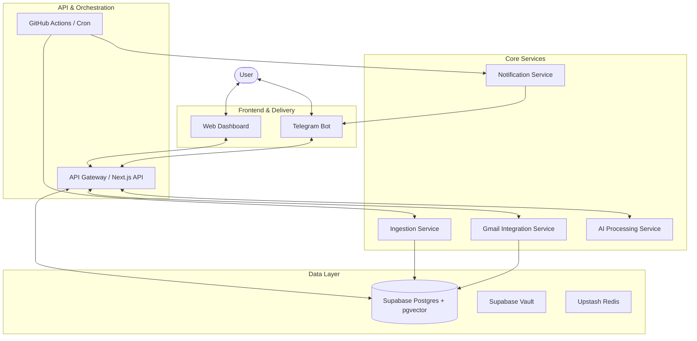
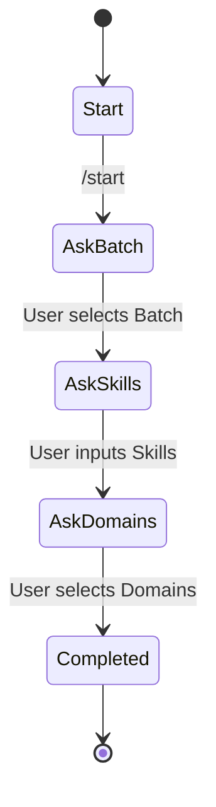

# OpportunityIQ - Complete System Specification
*Author: Antigravity (Principal Software Architect)*

This document outlines the complete, production-grade system specification for **OpportunityIQ**, an AI-powered Opportunity Intelligence Platform for students and developers.

---

## 1. Product Vision
OpportunityIQ aims to be the definitive personalized, AI-curated intelligence layer that aggregates, deduplicates, ranks, and delivers high-signal opportunities (internships, hackathons, placements, recruiter posts, and hiring signals) to users across web and Telegram. 

**Key Objectives:**
- **Personalization**: Match opportunities to user skills, batch year (e.g., 2027/2028), and domain preferences.
- **Efficiency**: Deduplicate identical opportunities from different sources.
- **Accessibility**: Deliver via frictionless channels (Telegram) and a data-dense web dashboard.
- **Cost-Effective Scalability**: Start on free-tier infrastructure and scale to robust microservices.

---

## 2. System Architecture

We adopt a modular, microservice-oriented architecture to separate concerns and allow independent scaling of ingestion, processing, and delivery.

### Component Diagram


### Service Definitions

1.  **Ingestion Service**: 
    - **Tech**: Node.js/Python, Playwright, RSS parsers.
    - **Function**: Scrapes Devfolio, Devpost, Unstop, Greenhouse, Lever, Wellfound.
    - **Strategy**: Legal scraping via RSS, sitemaps, and public APIs. Rate-limiting enabled.
    - **LinkedIn Alternative**: Use Proxycurl or user CSV imports to avoid ToS violations.

2.  **Gmail Integration Service**:
    - **Tech**: Node.js, Google OAuth2 (PKCE).
    - **Function**: Reads placement/hiring emails from user-authorized accounts.
    - **Security**: Tokens stored in Supabase Vault.

3.  **AI Processing Service**:
    - **Tech**: Gemini 1.5 Flash (Free Tier) / OpenRouter.
    - **Function**: Deduplication (pgvector), 3-line summaries, eligibility checking, and relevance ranking.

4.  **Notification & Digest Service**:
    - **Tech**: Telegram Bot API, Supabase Edge Functions.
    - **Function**: Delivers twice-daily digests and on-demand alerts.

---

## 3. Database Design (Supabase Postgres)

We use Postgres with the `pgvector` extension for embedding-based operations.

### Schema Snippets

```sql
-- Enable pgvector
CREATE EXTENSION IF NOT EXISTS vector;

-- Users & Profiles
CREATE TABLE users (
    id UUID PRIMARY KEY REFERENCES auth.users,
    email TEXT UNIQUE,
    created_at TIMESTAMP WITH TIME ZONE DEFAULT NOW()
);

CREATE TABLE profiles (
    user_id UUID PRIMARY KEY REFERENCES users(id),
    skills TEXT[],
    interests TEXT[],
    tracked_companies TEXT[],
    batch_year INT, -- e.g., 2027
    cgpa DECIMAL(3,2),
    domain_preferences TEXT[],
    profile_embedding VECTOR(1536), -- Generated from skills + interests
    updated_at TIMESTAMP WITH TIME ZONE DEFAULT NOW()
);

-- Opportunities
CREATE TABLE opportunities (
    id UUID PRIMARY KEY DEFAULT gen_random_uuid(),
    title TEXT NOT NULL,
    company TEXT NOT NULL,
    description TEXT,
    url TEXT UNIQUE NOT NULL,
    source TEXT NOT NULL, -- e.g., 'Devfolio', 'Greenhouse'
    deadline TIMESTAMP WITH TIME ZONE,
    eligibility_criteria JSONB, -- { batch: [2027, 2028], min_cgpa: 7.5 }
    tags TEXT[],
    opportunity_embedding VECTOR(1536), -- Generated from description
    created_at TIMESTAMP WITH TIME ZONE DEFAULT NOW()
);

-- User-Opportunity Relevance
CREATE TABLE user_opportunity_relevance (
    user_id UUID REFERENCES users(id),
    opportunity_id UUID REFERENCES opportunities(id),
    relevance_score FLOAT,
    status TEXT DEFAULT 'pending', -- 'pending', 'sent', 'saved'
    PRIMARY KEY (user_id, opportunity_id)
);

-- Gmail Tokens (Securely stored)
CREATE TABLE gmail_tokens (
    user_id UUID PRIMARY KEY REFERENCES users(id),
    access_token TEXT,
    refresh_token TEXT,
    expires_at TIMESTAMP WITH TIME ZONE
);
```

*Indexes on `deadline`, `source`, and `batch_year` will be added for performance.*

---

## 4. Telegram Bot Flow

The bot handles onboarding, on-demand queries, and profile management.

### Command Flows
- `/start`: Initiates the onboarding wizard (Asks for batch year, skills, interests).
- `/digest`: Generates an on-demand AI digest of the top 5 relevant opportunities.
- `/internships`: Shows internships with interactive filters (Domain, Remote).
- `/hackathons`: Shows upcoming and live hackathons.
- `/trackcompany`: Adds a company to the user's watchlist.
- `/alerts`: Toggles push notifications on/off.
- `/profile`: Displays and allows editing of user profile data.

### State Machine (Onboarding)


---

## 5. Frontend & Web Dashboard (UI/UX)

A data-dense, dark-mode-first dashboard built with **Next.js**, **shadcn/ui**, and **Tailwind CSS**.

### Component Tree (Dashboard)
```text
DashboardLayout
├── Sidebar (Navigation, Profile Summary)
├── Header (User Profile, Notifications)
└── Main Content
    ├── OpportunityFeed (Cards with Relevance Scores & Deadline Chips)
    ├── CompanyTrackerPanel (List of tracked companies + Add button)
    ├── GmailIntegrationCard (OAuth button + Status)
    └── DigestPreviewSection (Mockup of Telegram digest)
```

### Key Pages
1.  **Landing Page**: Hero section, features, Telegram bot CTA.
2.  **Auth Page**: Supabase Auth (Magic Link / GitHub).
3.  **Dashboard**: The core feed and control center.
4.  **Admin Panel**: Scraper health monitor, analytics (charts by source, category).

---

## 6. MVP Free-Tier Deployment Strategy

To launch without infrastructure costs, we map services to free tiers:

| Service | Platform | Rationale |
| :--- | :--- | :--- |
| **Database & Auth** | Supabase | Free Postgres with pgvector, 50k MAUs. |
| **Frontend** | Vercel | Excellent Next.js support, generous free tier. |
| **Scraper Cron** | GitHub Actions | 2,000 free minutes/month for scheduled runs. |
| **Scraper Fallback**| Render.com | Free web service for heavier scraping jobs. |
| **AI Processing** | Gemini API | Generous free tier for 1.5 Flash. |
| **Rate Limiting** | Upstash Redis | 10k commands/day free. |

**Cold-Start Mitigation**: Use GitHub Actions to "wake up" the Render free service before running scrapes.

---

## 7. Scalable Production Architecture

When scaling beyond MVP, the following migrations are planned:

- **Compute**: Move from GitHub Actions/Render to **Railway** or **Fly.io** for persistent containerized workers.
- **Queue System**: Implement **BullMQ** or **Inngest** for robust job management.
- **Vector Search**: If Supabase pgvector hits limits, migrate to **Pinecone** or dedicated Qdrant instance.
- **Edge Caching**: Use **Cloudflare Workers** to cache generated digests and reduce DB load.

---

## 8. Monetization & SaaS Scalability

A tiered model to monetize the platform:

| Tier | Price | Features |
| :--- | :--- | :--- |
| **Free** | $0 | 2 digests/day, 3 tracked companies, basic filters. |
| **Pro** | $5/mo | Unlimited digests, Gmail integration, priority ranking. |
| **Team** | $15/mo | For TPOs/Placement cells. Bulk exports, custom branding. |

---

## 9. AI Workflow Design

The end-to-end pipeline for processing an opportunity:

1.  **Ingestion**: Raw text extracted from source.
2.  **Chunking & Cleaning**: Remove boilerplate HTML/text.
3.  **Embedding**: Generate vector using Gemini or OpenAI text-embedding-ada-002.
4.  **Deduplication**: Query Supabase using `pgvector` distance (`<=>` < 0.1). If duplicate, merge sources.
5.  **Structured Extraction**: Gemini Flash extracts Title, Company, Deadline, Eligibility (Batch, CGPA).
6.  **Relevance Scoring**: Compute dot product between user profile vector and opportunity vector.
7.  **Digest Assembly**: Rank by score and format into Markdown.

---

## 10. Risks, Limitations, & Legal-Safe Alternatives

| Risk | Mitigation |
| :--- | :--- |
| **LinkedIn Scraping** | DO NOT scrape LinkedIn directly. Use Proxycurl API or rely on user-submitted links. |
| **Gmail OAuth Approval** | Google requires verification for sensitive scopes. Start with restricted internal testing. |
| **IP Blocks on Scrapers** | Use rotating proxies (if budget allows) or spread scrapers across GitHub Actions runners. |
| **Gemini Rate Limits** | Implement exponential backoff and fall back to Mistral via OpenRouter if exhausted. |

---

## 11. Engineering Roadmap

### Phase 1: Foundation (Weeks 1–3)
- Setup Supabase DB and schema.
- Build Telegram Bot MVP (Polling mode).
- Implement GitHub Actions scrapers for Devfolio and Unstop.

### Phase 2: Web & Integration (Weeks 4–6)
- Build Next.js Web Dashboard.
- Implement Gmail OAuth2 flow.
- Setup AI pipeline for deduplication and summarization.

### Phase 3: Intelligence (Weeks 7–10)
- Implement pgvector-based relevance ranking.
- Build the Admin Panel for scraper monitoring.
- Refine digest templates.

### Phase 4: Scale & Monetize (Weeks 11–16)
- Implement Stripe for Pro tier.
- Migrate scrapers to Railway.
- Optimize DB queries and add caching.
